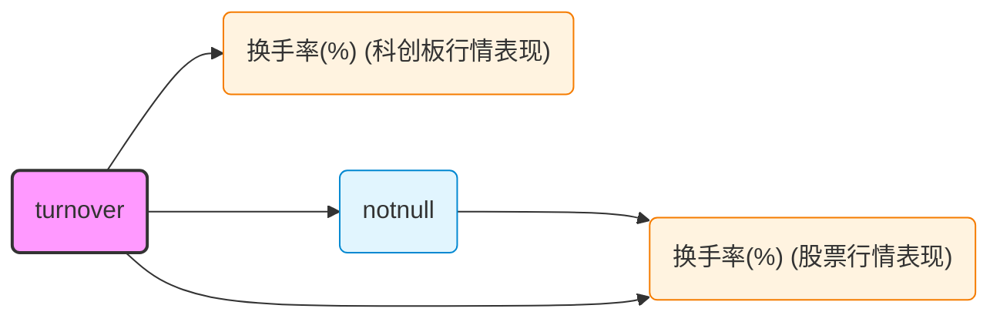

# QSRegistry — API 参考

> 返回 [总览](QSGraphDB设计.md)

## Python 类设计

### 类定义

```python
# QSExt/QSRegistry/QSGraphDB.py

from QSExt.Tools.Neo4jFun import QSNeo4jObject

class QSGraphDB(QSNeo4jObject):
    """基于 Neo4j 的 QuantStudio 计算图注册中心

    QuantStudio 计算图的核心存储引擎，存储因子、回测、风险模型等计算节点的元数据、
    依赖关系图和数据引用，以及算子、因子表、风险库、组合优化器等支撑节点的注册信息。
    支持检索、重建计算、依赖分析和影响范围查询。

    继承 QSNeo4jObject 复用 Neo4j 连接管理（PID 检测、断线重连、session 管理）。
    参数通过 ~/QuantStudioConfig/QSGraphDBConfig.json 配置或显式传入。
    """

    class __QS_ArgClass__(QSNeo4jObject.__QS_ArgClass__):
        Name: str = Field(default="QSGraphDB", frozen=True, title="图数据库名称")
        OllamaBaseURL: str = Field(default="http://127.0.0.1:11434", frozen=True, exclude=True, title="Ollama 服务地址")
        OllamaAPIKey: str = Field(default="ollama", frozen=True, exclude=True, repr=False, title="Ollama API Key")
        EmbeddingModel: str = Field(default="", frozen=True, exclude=True, title="嵌入模型名，空字符串表示禁用")
        EmbeddingDim: int = Field(default=0, frozen=True, exclude=True, title="预期嵌入维度，0=自动检测")
        DataDir: Optional[str] = Field(default=None, frozen=False, exclude=True, title="数据因子内联数据存储目录")

    def __init__(self, args={}, config_file=None, **kwargs):
        super().__init__(args=args, config_file=config_file, **kwargs)
        self._FactorDBRegistry: Dict[str, "FactorDB"] = {}
        if self._QSArgs.DataDir is None:
            self._QSArgs.DataDir = os.path.join(tempfile.gettempdir(), "QS_QSGraphDB_Data")
```

**设计要点：**

- 继承 `QSNeo4jObject`（非 `FactorDB`），因为本类存储的是图元数据而非因子数据
- 复用 QSNeo4jObject 的连接管理（IPAddr/Port/User/Pwd/DBName 参数、PID 检测、断线重连）
- Neo4j 连接参数通过继承获得，无需重复定义 Neo4jURI/Neo4jUser/Neo4jPwd/Neo4jDB
- 遵循框架的配置优先级：显式参数 > JSON 配置文件 > 默认值
- `DataDir` 用于 DataFactor 的内联数据（DataFrame/Series）持久化
- `_FactorDBRegistry` 维护已注册的 FactorDB 实例，用于重建时查找数据源
- `connect()` 方法调用 `super().connect()` 后再执行 `_initSchema()` → `_initVectorIndex()`，自动创建约束、索引和向量索引

### 生命周期

```python
def connect(self) -> "QSGraphDB":
    """连接到 Neo4j 数据库，首次连接自动创建约束和索引"""
    super().connect()  # QSNeo4jObject._connect() — PID 检测、断线重连
    self._initSchema()
    return self

# disconnect() 继承自 QSNeo4jObject，无需覆盖
# _runCypher() 复用 self.session()，内置 PID 检测和断线重连
```

---

## API 方法清单

### 存储（Store）

#### `registerFactorDB(fdb: FactorDB) -> str`

注册一个因子库到图数据库和内存注册表。将 FactorDB 的连接信息（类型、路径等）序列化为 FactorDB 节点存入图中。

**参数：**
- `fdb`: QuantStudio FactorDB 实例（如 HDF5DB、JYDB）

**返回：** FactorDB 的 Name

**逻辑：**
1. 从 `fdb._QSArgs` 提取连接信息（如 HDF5DB 的 `MainDir`）
2. MERGE FactorDB 节点（幂等）
3. 将 `fdb` 实例加入 `_FactorDBRegistry`

#### `storeFactorTable(ft: FactorTable, fdb_name: Optional[str] = None) -> str`

存储因子表节点，并建立 `属于因子库` 关系。

**参数：**
- `ft`: FactorTable 实例
- `fdb_name`: 关联的 FactorDB 名称（可选，若 ft.FactorDB 已注册则自动关联）

**返回：** FactorTable 的 QSID

#### `storeFactorOperator(op: FactorOperator) -> str`

存储单个算子节点。

**参数：**
- `op`: FactorOperator 实例

**返回：** 算子的 QSID

#### `storeFactors(factors: List[Factor], tags: Optional[Dict[str, List[str]]] = None) -> List[str]`

**核心方法**。批量存储多个因子及其完整依赖 DAG。

**参数：**
- `factors`: 根因子列表（共享的依赖因子自动去重）
- `tags`: QSID → 标签列表 的映射（仅对根因子打标签）

**返回：** 各根因子的 QSID 列表（与输入顺序一致）

**算法（8 个阶段）：**
1. 遍历所有根因子的 DAG，收集因子、算子、因子表（去重，不立即写入）
2. 注册 FactorDB 并逐条存储 FactorTable（表数量少，逐条写入即可）
3. 拓扑排序因子，确保叶子节点先序列化
4. 批量生成嵌入向量（若配置了 EmbeddingModel）
5. 单条 UNWIND 查询 MERGE 所有因子节点
6. 单条 UNWIND 查询 MERGE 所有算子节点
7. 3 条 UNWIND 查询分别创建 `使用算子`、`属于因子表`、`依赖` 关系
8. 单条 UNWIND 查询创建标签关系

**性能对比：** 对于包含 N 个因子的 DAG（平均 K 个描述子），旧方案产生 N×(K+3) 条 Cypher 查询，新方案固定 6 条（不含 FactorTable 的逐条写入）。

### 检索（Retrieve）

#### `getFactorByQSID(qsid: str) -> Optional[Dict]`

按 QSID 查询单个因子节点的全部属性。

#### `searchFactors(name=None, operator_type=None, operator_name=None, tag=None, factor_class=None, limit=100) -> List[Dict]`

多条件组合搜索因子。各参数间为 AND 关系，均支持模糊匹配。

**示例：**
```python
from QSExt.QSRegistry.api import QSGraphDB

gdb = QSGraphDB()
gdb.connect()

# 搜索所有使用 Time 类型算子的因子
gdb.searchFactors(operator_type="Time")

# 搜索名称含 "momentum" 的因子
gdb.searchFactors(name="momentum")

# 搜索带 "alpha" 标签的因子
gdb.searchFactors(tag="alpha")
```

#### `searchFactorsByDescription(query_text: str, limit: int = 20, min_score: Optional[float] = None) -> List[Dict]`

基于描述文本的向量语义检索。使用 Ollama 将查询文本转为嵌入向量，通过 Neo4j 向量索引做余弦相似度搜索。

**参数：**
- `query_text`: 自然语言查询文本（如 "动量因子"、"成交量相关指标"）
- `limit`: 返回数量上限
- `min_score`: 最低相似度阈值 (0~1)，None 表示不过滤

**返回：** 因子属性字典列表，每项包含 `Similarity` 字段（0~1，越大越相似）

**前置条件：** `EmbeddingModel` 必须已配置（非空字符串）

**原理：** 调用 Ollama 生成查询文本嵌入 → `db.index.vector.queryNodes('factor_embedding', ...)` 做 ANN 检索 → 按余弦相似度降序返回

**示例：**
```python
results = gdb.searchFactorsByDescription("动量因子", limit=10, min_score=0.5)
for r in results:
    print(f"[{r['Similarity']:.4f}] {r['Name']}")
```

#### `getDependencyGraph(qsid: str, direction: str = "both") -> Dict`

获取因子的依赖子图。

**参数：**
- `direction`:
  - `"down"`: 沿 `依赖` 向下，获取所有输入因子
  - `"up"`: 沿 `依赖` 反向，获取所有下游因子
  - `"both"`: 双向

**返回：** `{"root": qsid, "nodes": [...], "edges": [...]}`

#### `getDescriptors(qsid: str) -> List[Dict]`

返回因子的直接依赖因子，按 `order` 排序。

#### `getDependents(qsid: str, transitive: bool = False) -> List[Dict]`

返回依赖该因子的因子。

- `transitive=False`: 仅直接下游
- `transitive=True`: 传递闭包，所有下游

#### `findOrphanFactors() -> List[Dict]`

查找无下游依赖且不属于因子表的叶子因子（可能是孤立节点）。

### 重建（Reconstruct）

#### `reconstructFactor(qsid: str, descriptor_map: Optional[Dict[str, Factor]] = None) -> Factor`

**核心方法**。从图中的元数据重建可计算的 Factor 对象。

**参数：**
- `qsid`: 目标因子的 QSID
- `descriptor_map`: 可选的预构建描述子映射 `{QSID: Factor}`，避免重复重建

**返回：** 可直接在计算引擎中使用的 Factor 实例

**重建策略（按 FactorClass 分派）：**

**DerivativeFactor 路径：**
1. 加载 `使用算子` 关系 → 算子节点
2. `importlib.import_module(ModulePath).ClassName` 导入算子类
3. 用存储的 ModelArgs 实例化算子
4. 若 `IsCustom=true`，从 CalculateRef 恢复 `calculate` 函数
5. 按 order 加载 `依赖` 关系中的描述子 QSID
6. 递归重建每个描述子（或从 descriptor_map 获取）
7. 调用 `operator(*descriptors, factor_args=parsed_qsargs)` 生成 Factor

**DataFactor 路径：**
1. 解析 DataRef JSON
2. 标量值直接使用；Series/DataFrame 从 HDF5 文件加载
3. 构造 `DataFactor(data=data, args=args)`

**FactorTableFactor 路径：**
1. 加载 `属于因子表` → 因子表 → `属于因子库` → 因子库
2. 从 `_FactorDBRegistry` 查找已注册的 FactorDB 实例
3. `fdb.getTable(table_name).getFactor(factor_name, args=args)`

#### `reconstructOperator(qsid: str) -> FactorOperator`

单独重建一个算子对象。

### 管理（Manage）

#### `deleteFactor(qsid: str, cascade: bool = False) -> int`

删除因子节点及其关系。

- `cascade=True`: 额外检查并删除因本次删除而变为孤立的下游因子
- 返回删除的节点数

#### `updateFactorMetaData(qsid: str, meta: Dict) -> None`

更新因子的 MetaJSON 属性。

#### `updateFactorTags(qsid: str, add_tags=None, remove_tags=None) -> None`

增删标签关系。自动创建尚不存在的 Tag 节点。

#### `renameFactor(qsid: str, new_name: str) -> None`

更新因子的 Name 属性。

### 分析（Analyze）

#### `impactAnalysis(qsid: str) -> List[Dict]`

影响范围分析。返回所有传递依赖该因子的下游因子，按依赖深度排序。

#### `findSimilarFactors(qsid: str) -> List[Dict]`

查找使用相同算子类型和名称的相似因子（不同的 ModelArgs 或描述子）。

#### `getGraphStats() -> Dict[str, int]`

返回各类节点和关系的计数统计。

#### `toMermaid(qsid: str | list[str], direction: str = "down") -> str`

生成因子依赖图的 **Mermaid flowchart** 源码，可直接嵌入 Markdown 渲染。

**参数：**
- `qsid`: 单个因子 QSID，或 QSID 列表（多个因子的依赖图合并显示）
- `direction`: `"down"`（该因子依赖谁）、`"up"`（谁依赖该因子）或 `"both"`（双向）

**返回：** Mermaid `flowchart LR` 源码字符串

**视觉设计：**

| 节点类型 | 形状 | 颜色 |
|---------|------|------|
| 目标因子（root） | 圆角矩形 | 粉色高亮 `#f9f` |
| DerivativeFactor | 圆角矩形 | 浅蓝 `#e1f5fe` |
| FactorTableFactor | 圆角矩形 | 浅橙 `#fff3e0` |
| DataFactor | 圆角矩形 | 浅绿 `#e8f5e9` |
| 回测（root） | 圆角矩形 | 浅紫 `#f3e5f5` |
| 回测结果 | 圆角矩形 | 浅灰 `#f5f5f5` |

> 因子名称中的特殊字符（`"`、`(`、`)`、`[`、`]`）通过 Mermaid HTML 实体（`#quot;`、`#40;`、`#41;` 等）转义，确保 Mermaid 语法正确。

**重名区分：** 当多个 FactorTableFactor 同名时，自动附加所属因子表名称（如 `换手率(%) (股票行情表现)`、`换手率(%) (科创板行情表现)`），通过批量查询 FactorTable 节点实现。

**示例输出：**


### 回测存储（Backtest Store）

#### `storeBacktest(bt_node, tags=None, dtrange=None) -> str`

存储回测节点及其依赖关系。

**参数：**
- `bt_node`: BTNode 实例（`IC`、`QuantilePortfolio`、`Strategy`...）
- `tags`: 可选的标签名称列表
- `dtrange`: 可选的时点范围 `(start_dt, end_dt)`

**返回：** 回测节点 QSID（继承自 BTNode.QSID）

**逻辑：**
1. 根据模块路径判定 `BacktestCategory`
2. 序列化 `__QS_ArgClass__` 为 QSArgsJSON
3. MERGE 回测节点（幂等，同一配置多次运行合并）
4. 从 `bt_node.Deps` 中提取 Factor 节点 → 创建 `[:依赖]` 关系
5. 若 Deps 中包含其他 BTNode → 创建子回测 `[:依赖]` 关系
6. 创建标签关系

#### `storeBacktestResults(bt_qsid: str, output: dict, dtrange: tuple) -> List[str]`

存储回测结果，将 `backward_compute()` 返回的 dict 中的各项挂载到回测节点上。

**参数：**
- `bt_qsid`: 回测节点 QSID
- `output`: `BTNode.backward_compute()` 返回的 dict
- `dtrange`: `(start_dt, end_dt)` 时点范围

**返回：** 各 ResultID 列表

**存储策略：**
- DataFrame/Series（非空）→ 写入 HDF5 文件，摘要存节点属性
- 长字符串（>500 字符，如 HTML 报告）→ 写入 HDF5 文件
- 标量、短字符串 → 内联在 SummaryJSON 中

**ResultID 生成：** `sha256(bt_qsid + key + dtrange_start + dtrange_end)[:16]`，确保同配置+同时点范围幂等。

**HDF5 路径：** `{DataDir}/{ResultID前8位}/{ResultID}.hdf5`

### 回测检索（Backtest Retrieve）

#### `getBacktestByQSID(qsid: str) -> Optional[Dict]`

按 QSID 查询单个回测节点的全部属性。

#### `searchBacktests(name=None, category=None, factor_qsid=None, limit=100) -> List[Dict]`

多条件组合搜索回测。

**参数：**
- `name`: 回测名称（模糊匹配）
- `category`: 回测类别筛选
- `factor_qsid`: 因子 QSID，查找使用了该因子的所有回测（**核心查询**：从因子出发找所有相关回测）
- `limit`: 返回数量上限

**示例：**
```python
# 查找所有使用了某因子的回测
gdb.searchBacktests(factor_qsid="a1b2c3d4...")

# 查找所有 IC 类回测
gdb.searchBacktests(category="SectionFactor", name="IC")
```

#### `getBacktestResults(bt_qsid: str) -> List[Dict]`

获取某个回测的所有结果节点，按 Key 排序。

#### `getBacktestResult(result_id: str) -> Optional[Dict]`

按 ResultID 查询单个结果节点。

#### `getBacktestDependencyGraph(bt_qsid: str, direction="down") -> Dict`

获取回测的依赖子图，包含依赖的因子节点和子回测节点。

#### `getFactorBacktests(factor_qsid: str) -> List[Dict]`

查询某个因子被哪些回测使用过。从因子出发的反向追溯。

### 回测管理（Backtest Manage）

#### `deleteBacktest(qsid: str, delete_results=True) -> int`

删除回测节点及其关系。

- `delete_results=True`: 同时删除关联的回测结果节点并清理 HDF5 文件
- 返回删除的节点总数

### 工具方法

#### `executeCypher(query: str, parameters: Optional[Dict] = None) -> List[Dict]`

原始 Cypher 查询接口，用于高级查询场景。

### 报告存储（Report Store）

#### `storeReport(report_path, factor_qsids, bt_qsid=None, scenario_name=None, name=None) -> str`

将本地报告文件注册到图数据库。报告文件保留在本地，图节点仅存储路径和元数据。

**参数：**
- `report_path`: 报告文件的本地绝对路径
- `factor_qsids`: 报告涉及的因子 QSID 列表
- `bt_qsid`: 产生此报告的回测 QSID（可选）
- `scenario_name`: 场景名称（如 `"single_factor"`）
- `name`: 报告名称，默认使用文件名

**返回：** ReportID（`sha256(filepath + filesize + mtime)[:16]`，同文件幂等）

**逻辑：**
1. 验证文件存在，判定格式（html/markdown/pdf）
2. 生成确定性 ReportID
3. MERGE 报告节点（幂等）
4. 创建 `(因子)-[:有报告]->(报告)` 关系
5. 若提供 bt_qsid，创建 `(回测)-[:产生报告]->(报告)` 关系

### 报告检索（Report Retrieve）

#### `getReport(report_id: str) -> Optional[Dict]`

按 ReportID 查询报告节点全部属性。

#### `getFactorReports(factor_qsid: str) -> List[Dict]`

获取某个因子的所有报告，按文件修改时间倒序。

#### `getBacktestReports(bt_qsid: str) -> List[Dict]`

获取某个回测产生的所有报告，按文件修改时间倒序。

#### `searchReports(name=None, scenario_name=None, factor_qsid=None, fmt=None, limit=100) -> List[Dict]`

多条件组合搜索报告。

**参数：**
- `name`: 报告名称（模糊匹配）
- `scenario_name`: 场景名称筛选
- `factor_qsid`: 关联的因子 QSID
- `fmt`: 格式筛选（html/markdown/pdf）
- `limit`: 返回数量上限

### 报告管理（Report Manage）

#### `deleteReport(report_id: str, delete_file: bool = False) -> bool`

删除报告节点，可选删除本地文件。

- `delete_file=False`: 仅移除图节点，保留本地文件
- `delete_file=True`: 同时删除本地文件

### 因子存储器存储（FactorStorer Store）

#### `storeFactorStorer(storer: FactorStorer, tags=None) -> str`

存储因子存储器节点。FactorStorer 是计算图中负责将因子数据写入目标因子库/表的节点。

**参数：**
- `storer`: FactorStorer 实例
- `tags`: 可选的标签名称列表

**返回：** FactorStorer 的 QSID

**逻辑：**
1. 序列化 QSArgs（TargetFDB 实例转为 `{__type__, __module__, Name}` 引用）
2. MERGE 因子存储器节点（幂等）
3. 建立与依赖因子的 `[:依赖]` 关系（递归处理 split=True 场景）
4. 在图库中查找目标因子表是否已注册 → 若未注册但目标因子库中存在该表，则自动调用 `storeFactorTable` 注册
5. 建立 `(因子存储器)-[:写入因子表]->(因子表)` 关系
6. 为每个依赖因子建立 `(因子)-[:存入因子表]->(因子表)` 关系（标记因子已被该存储器存入目标表）
7. 创建标签关系

#### `getFactorStorerByQSID(qsid: str) -> Optional[Dict]`

按 QSID 查询因子存储器节点的全部属性。

#### `searchFactorStorers(target_table=None, target_fdb=None, factor_qsid=None, limit=100) -> List[Dict]`

多条件组合搜索因子存储器。

**参数：**
- `target_table`: 目标因子表名称（模糊匹配）
- `target_fdb`: 目标因子库名称（模糊匹配）
- `factor_qsid`: 依赖的因子 QSID，查找依赖该因子的所有存储器
- `limit`: 返回数量上限

**示例：**
```python
# 查找写入 HDF5DB 因子库的所有存储器
gdb.searchFactorStorers(target_fdb="HDF5DB")

# 查找依赖 momentum 因子的所有存储器
gdb.searchFactorStorers(factor_qsid=momentum.QSID)
```

#### `deleteFactorStorer(qsid: str) -> None`

删除因子存储器节点及其所有关系。

### 风险库存储（RiskDB Store）

#### `registerRiskDB(risk_db) -> str`

注册风险库到图数据库。

- `risk_db`: QuantStudio RiskDB 实例
- 返回风险库名称

#### `storeRiskTable(rt, risk_db_name=None) -> str`

存储风险表节点，自动建立 `(风险表)-[:属于风险库]->(风险库)` 关系。

- `rt`: RiskTable 实例
- `risk_db_name`: 关联的风险库名称，默认从 `rt.RiskDB.Name` 获取

#### `linkBacktestRiskTable(bt_qsid, rt_qsid) -> None`

建立回测（风险模型）与风险表的 `依赖风险表` 关系。

### 风险表检索（RiskTable Retrieve）

#### `getRiskTableByQSID(qsid: str) -> Optional[Dict]`

按 QSID 查询风险表节点。

#### `searchRiskTables(name=None, limit=100) -> List[Dict]`

搜索风险表，支持按名称模糊匹配。

### 组合优化器存储（Optimizer Store）

#### `storeOptimizer(pc, tags=None) -> str`

存储组合优化器节点。

- `pc`: BasePC 实例（CVXPC、MatlabPC 等）
- `tags`: 可选的标签列表

#### `linkBacktestOptimizer(bt_qsid, pc_qsid) -> None`

建立回测（策略）与组合优化器的 `使用优化器` 关系。

### 组合优化器检索（Optimizer Retrieve）

#### `getOptimizerByQSID(qsid: str) -> Optional[Dict]`

按 QSID 查询组合优化器节点。

#### `searchOptimizers(name=None, optimizer_type=None, limit=100) -> List[Dict]`

搜索组合优化器，支持按名称和类型筛选。

- `optimizer_type`: `CVXPC` / `MatlabPC` / `BasePC`

#### `deleteOptimizer(qsid: str) -> None`

删除组合优化器节点及其所有关系。

### 因子向量化检索

#### 概述

QSGraphDB 支持对因子描述文本生成嵌入向量并存储到 Neo4j 中，利用 Neo4j 原生向量索引实现基于语义的因子检索。当配置了 `EmbeddingModel` 后，`storeFactors` 会在存储因子时自动生成嵌入向量。

**架构流程：**

```
因子描述文本（Name + Meta.Description + Operator.Description）
    → Ollama /api/embeddings (bge-m3 / qwen3-embedding)
    → 1024 / 4096 维向量
    → 存储到 Neo4j Factor 节点 Embedding 属性
    → 在 Embedding 属性上创建 VECTOR INDEX (cosine)
    → searchFactorsByDescription 调用 db.index.vector.queryNodes
```

#### 配置

通过配置文件或构造函数参数启用：

```json
{
    "EmbeddingModel": "bge-m3",
    "EmbeddingDim": 1024,
    "OllamaBaseURL": "http://127.0.0.1:11434",
    "OllamaAPIKey": "ollama"
}
```

| 参数 | 默认值 | 说明 |
|------|--------|------|
| `EmbeddingModel` | `""` | 嵌入模型名，空字符串表示禁用向量检索 |
| `EmbeddingDim` | `0` | 预期嵌入维度，0 = 自动检测 |
| `OllamaBaseURL` | `"http://127.0.0.1:11434"` | Ollama 服务地址 |
| `OllamaAPIKey` | `"ollama"` | Ollama API Key |

#### 描述文本组装规则

`_getFactorEmbeddingText` 按以下优先级聚合因子描述文本：

1. `factor._QSArgs.Name` — 因子名称（必有）
2. `factor.getMetaData(key="Description")` — 因子 Meta 中的 Description（若存在）
3. `factor.Operator._QSArgs.Description` — 算子描述（仅 DerivativeFactor，若存在）

三个来源用空格拼接去重，作为嵌入生成的输入文本。

#### 向量索引管理

连接时自动调用 `_initVectorIndex()`，通过 `CREATE VECTOR INDEX IF NOT EXISTS` 创建索引。若 Neo4j 版本不支持向量索引，catch 异常并 log warning，不影响其他功能。

#### 可用模型

| 模型 | 维度 | 适用场景 |
|------|------|----------|
| `bge-m3` | 1024 | 通用中文语义检索，速度快 |
| `qwen3-embedding:8b` | 4096 | 更高精度，适合复杂语义理解 |
